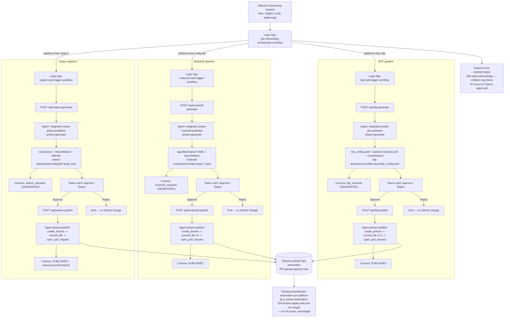
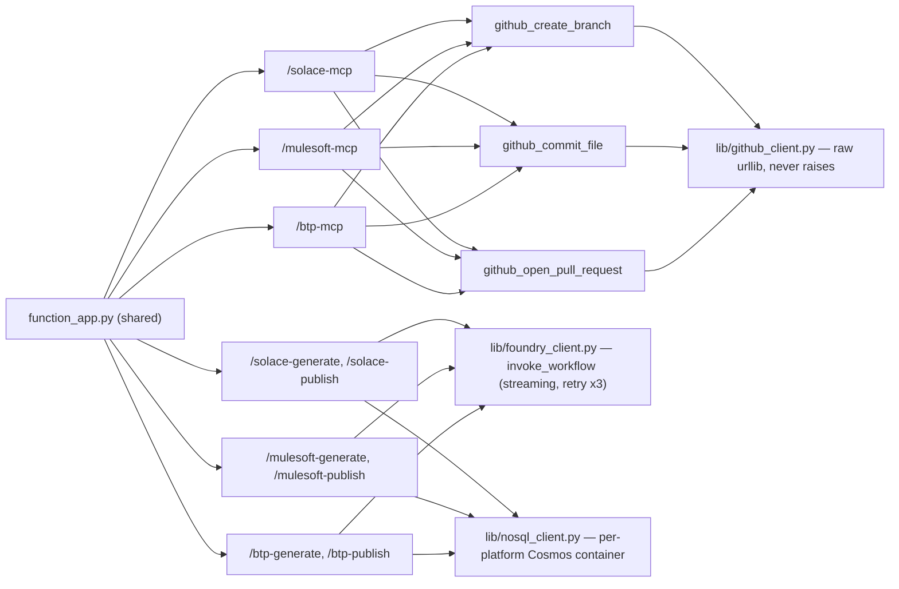

# 3PL Onboarding — End-to-End Flow Overview

This diagram reflects the multi-platform architecture: one master orchestrator fans out to three
independent, platform-specific generate → approve → publish pipelines (Solace, MuleSoft, BTP),
each backed by its own Azure AI Foundry agent and sharing one Azure Functions MCP server.
`HLD.drawio`/`LLD.drawio` in this same folder cover the identical architecture as draw.io
diagrams (component view and sequence-diagram view respectively) — MuleSoft and BTP, marked as
future scope (🚧) in the legacy `3PL-Automation/diagrams/3pl-automation-architecture.drawio` HLD,
are now fully implemented (✅) alongside Solace across all three diagrams.

## Shared infrastructure (not platform-specific)

One Azure Functions app (`mcp-server/`, deployed as `ip-3pl-mcp.azurewebsites.net`) hosts all 3
platforms' MCP tool servers and HTTP routes:

## Key properties

- **Per-platform agents stay separate** — `integration-pulse-{solace,mulesoft,btp}-publisher` each
  have their own `agent.yaml` + `system-prompt.md`, because their output contracts genuinely
  differ (JSON for Solace, multi-file YAML for MuleSoft, YAML + optional manifest for BTP).
- **GitHub tools are shared** — `github_create_branch`, `github_commit_file`,
  `github_open_pull_request` are the same 3 implementations behind all 3 platforms' MCP routes.
- **Human approval is mandatory** — no platform ever writes to GitHub without a Teams
  Approve click; Reject ends the pipeline with no side effects.
- **Cosmos is audit-only** — the approval flow's state lives in the Logic App run, not Cosmos;
  each platform's `{platform}_requests` container exists for traceability, not as a dependency
  for the approval flow to function.
- **The AI-Foundry layer's job ends at "PR opened against main"** — actual provisioning into
  Solace Cloud / Anypoint Platform / BTP cockpit remains each platform's own existing automation
  (`solace-automation`'s GitHub Actions, `mulesoft-automation`/`btp-automation`'s own Logic Apps),
  triggered independently once a PR merges.
