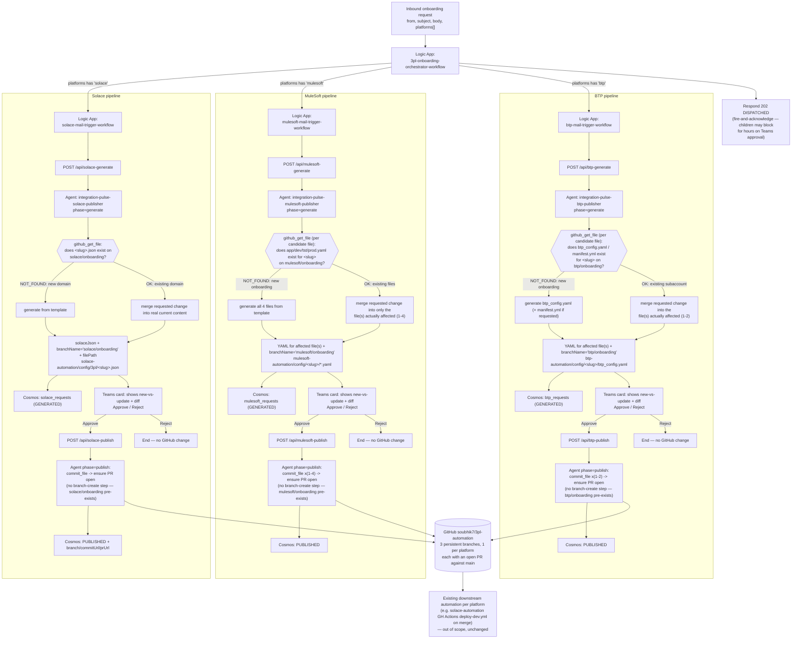
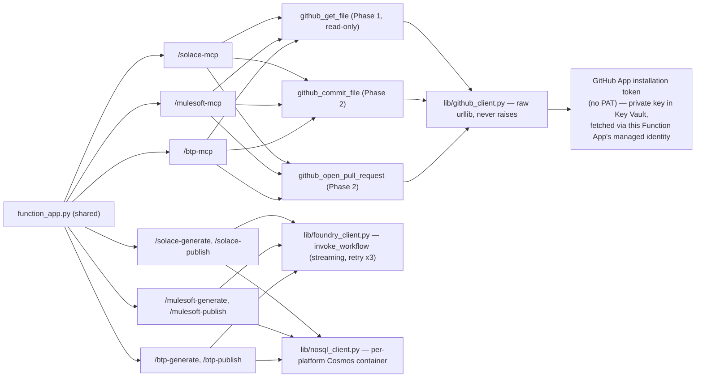

# 3PL Onboarding — End-to-End Flow Overview

This diagram reflects the multi-platform architecture: one master orchestrator fans out to three
independent, platform-specific generate → approve → publish pipelines (Solace, MuleSoft, BTP),
each backed by its own Azure AI Foundry agent and sharing one Azure Functions MCP server.
`HLD.drawio`/`LLD.drawio` in this same folder cover the identical architecture as draw.io
diagrams (component view and sequence-diagram view respectively) — MuleSoft and BTP, marked as
future scope (🚧) in the legacy `3PL-Automation/diagrams/3pl-automation-architecture.drawio` HLD,
are now fully implemented (✅) alongside Solace across all three diagrams.

## Shared infrastructure (not platform-specific)

One Azure Functions app (`mcp-server/`, deployed as `ip-solace-mcp.azurewebsites.net`) hosts all 3
platforms' MCP tool servers and HTTP routes:

## Key properties

- **Per-platform agents stay separate** — `integration-pulse-{solace,mulesoft,btp}-publisher` each
  have their own `agent.yaml` + `system-prompt.md`, because their output contracts genuinely
  differ (JSON for Solace, multi-file YAML for MuleSoft, YAML + optional manifest for BTP).
- **Any config change, not just new onboardings** — each agent's Phase 1 calls `github_get_file`
  first to check whether the target partner/slug's file(s) already exist. `NOT_FOUND` → generate
  fresh from the template (a new domain/onboarding/subaccount). `OK` → parse the real current
  content and merge in only the change the request describes, leaving everything else untouched
  (an update — add a queue, change a NAV host, adjust an entitlement, bump app memory, etc.). The
  Teams card always shows the human exactly what the agent is about to do either way.
- **GitHub tools are shared** — `github_get_file`, `github_commit_file`, `github_open_pull_request`
  are the same 3 implementations behind all 3 platforms' MCP routes. There is no branch-creation
  tool: each platform commits to one persistent feature branch (`solace/onboarding`,
  `mulesoft/onboarding`, `btp/onboarding`), created once manually (see root `README.md` "One-time
  setup"), never by an agent — every approved request, new or update, is just another commit on
  that branch (one file per partner/slug, so concurrent requests never collide), and
  `github_open_pull_request` ensures a PR is open from it (idempotent — reuses the existing PR
  after the first request).
- **No PAT/long-lived token anywhere** — `lib/github_client.py` authenticates to GitHub as a
  GitHub App: its private key lives in Key Vault, fetched via this Function App's managed
  identity, exchanged for a short-lived (1 hour) installation token that's cached in memory and
  auto-refreshed. No human-managed token sits in an App Setting.
- **Human approval is mandatory for every kind of change** — `github_commit_file` and
  `github_open_pull_request` only ever get called from Phase 2, which only ever runs after a Teams
  Approve click, whether the change is a brand-new config or an update to an existing one. There
  is no path from request to commit, for any of the 3 platforms, that skips that gate; Reject ends
  the pipeline with no side effects either way.
- **Cosmos is audit-only** — the approval flow's state lives in the Logic App run, not Cosmos;
  each platform's `{platform}_requests` container exists for traceability, not as a dependency
  for the approval flow to function.
- **The AI-Foundry layer's job ends at "commit added, PR open against main"** — actual
  provisioning into Solace Cloud / Anypoint Platform / BTP cockpit remains each platform's own
  existing automation (`solace-automation`'s GitHub Actions, `mulesoft-automation`/
  `btp-automation`'s own Logic Apps), triggered independently once a PR merges.
